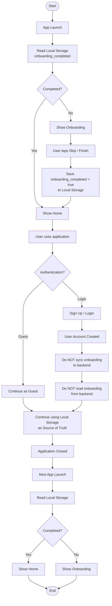

```bash
                              ●
                              │
                              ▼
                     App Launch
                              │
                              ▼
                  Read Local Storage
             onboarding_completed ?
                              │
                 ┌────────────┴────────────┐
                 │                         │
            [false / null]             [true]
                 │                         │
                 ▼                         ▼
          Show Onboarding             Show Home
                 │                         │
                 │                         │
         Skip / Finish                     │
                 │                         │
                 ▼                         │
   Save onboarding_completed = true        │
        to Local Storage                   │
                 │                         │
                 └────────────┬────────────┘
                              │
                              ▼
                   User uses application
                              │
                     ┌────────┴────────┐
                     │                 │
               Continue as Guest   Sign Up / Login
                     │                 │
                     │                 ▼
                     │         User Account Created
                     │                 │
                     │                 ▼
                     │      Do NOT sync onboarding
                     │        to backend server
                     │                 │
                     │                 ▼
                     │      Do NOT read onboarding
                     │       
                     │                 │
                     └────────┬────────┘
                              │
                              ▼
                 Continue using application
                 (Local Storage is source of truth)
                              │
                              ▼
                      Application Closed
                              │
                              ▼
                        Next App Launch
                              │
                              ▼
                   Read Local Storage
             onboarding_completed ?
                              │
                 ┌────────────┴────────────┐
                 │                         │
              [true]                  [false]
                 │                         │
                 ▼                         ▼
            Show Home              Show Onboarding
                 │                         │
                 └────────────┬────────────┘
                              │
                              ▼
                              ◎
```



